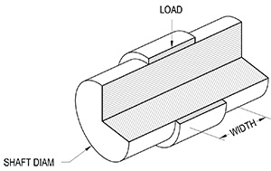
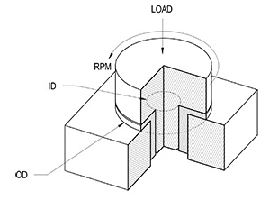

[gimmick: math]()

Bearings: Plain PV
===

Notes & Use
---

Calculates design values (velocity, force, and combined) of plain bearings when the following are true:

* For radial (journal) applications
    * the bearing rotates around a shaft,
    * the rotational motion is continuous (as opposed to an ocillating),
    * the load is applied perpidicular to the axis of rotation (radial).
* For thrust applications:
    * the load rotates upon the bearing, around a fixed center point,
    * the thrust bearing's bearing surface is circular or annular,
    * the rotational motion is continuous,
    * the load is applied parallel to the axis of rotation,
    * the load is uniform across the surface area of the bearing.

This calculator does *not* address any issues beyond P, V, and PV calculations, such as:

* Effects of friction,
* Additional heat and energy-dispersal concerns,
* Dimensional changes due to heat deformation,
* Tribology/lubrication concerns,
    * including cleanliness and suitability of lubricants 
* Wear factors
* Operating Temperatures
* Lifetime calculations
* Shock-load and impact factors

Radial Figure
---

Radial Terms
---

L = load on bearing, *pounds force*

n = Shaft speed, *rotations per minute*

d = Diameter of shaft (ID of bearing), *inches*

w = Bearing width, *inches*

P = Pressure on bearing, *psi*

V = velocity of bearing surface, *feet per minute*

PV = Pressure &times; Velocity

Radial Equations
---

$$ P_{actual} =
    \frac {L} {w d}
$$

$$ V_{actual} =
    \frac {n  d  \pi} {12}
$$

Thrust Figure
---

Thrust Terms
---

L = load on bearing, *pounds force*

n = Rotation speed, *rotations per minute*

d = Inner diameter of bearing's surface area, *inches*

D = Outer diameter of bearing's surface area, *inches*

P = Pressure on bearing, *psi*

V = velocity of bearing surface, *feet per minute*

PV = Pressure &times; Velocity

Thrust Equation
---

$$ P_{actual} =
    \frac {4L} {\pi (D^2 - d^2)}
$$

$$ V_{actual} =
    \frac {n  \left( \frac{D - d}{4} \right)  \pi} {12}
$$

Pass/Fail Test
---
Pactual, Vactual, and PVactual are compared to the respective allowable values:

* Pass = actual < allowable
* Fail = actual &ge; allowable

Material P, V, and PV values
---

The design values provided by the drop-down material box are culled from various sources, notably [Mcmaster-Carr](http://www.mcmaster.com) and [Wikipedia](https://en.wikipedia.org/wiki/Journal_bearings). A full table of those values is as follows:

|Material|P|V|PV|
|------|------|------|------|
||*psi*|*fpm*|*psi&times;fpm*|
|SAE 841|2,000|1,200|50,000|
|Graphite SAE 841|1,600|1,000|40,000|
|SAE 660|4,000|750|75,000|
|SAE 841|2,000|1,200|50,000|
|SAE 863|4,000|225|35,000|
|Nylon|400|360|3,000|
|Nylon MDS #1|2,000|393|3,400|
|UHMWPE|1,000|100|2,000|
|Acetal|1,000|1,000|2,700|
|Ptfe|500|100|1,000|
|Ptfe (glass filled)|1,000|400|11,000|
|Rulon 641|1,000|400|10,000|
|Rulon J|750|400|7,500|
|Rulon LR|1,000|400|10,000|
|Peek (blend 1)|8,500|400|3,500|
|Peek (blend 2)|21,750|295|37,700|
|Vespel|4,900|3,000|30,0000|

Sources
---

* Robert L. Mott, *[Machine Elements in Mechanical Design](http://www.amazon.com/Machine-Elements-Mechanical-Design-Edition/dp/0130618853/ref=sr_1_1?ie=UTF8&qid=1388274723&sr=8-1&keywords=mechanical+elements+in+machine+design)*, 4th ed. pp. 669, 2003.
* [Dupont Vespel Design Guide](http://www2.dupont.com/Vespel/en_US/assets/downloads/vespel_gen/E61500.pdf)
* [Mcmaster-Carr](http://www.mcmaster.com)
* [Wikipedia](https://en.wikipedia.org/wiki/Journal_bearings)