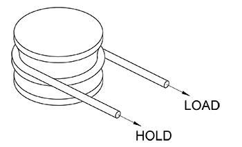

[gimmick: math]()

Capstan Holding Forces
===

Notes & Use
---

Calculates the relationship between a hold-force and load-force of a flexible line wrapped around a cylinder, such as a capstan or drum.

This calculator will calculate for either the hold-force or load-force by way of a user-selected drop down menu.

Figure
---

Terms
---

H = hold, *pounds force* (*Newtons*)

w = number of wraps

&Phi; = angle of wrap, *radians*

&mu;  = coeficient of friction

L = Load, *pounds force* (*Newtons*)

*e* = constant, approximately 2.71828...

Equations
---

Translate the number of wraps into equivalent radians:

$$ \phi = 2 \pi w $$

Calculate the load force from the holding force:

$$ L = H e ^ {\mu \phi} $$

Sources
---
[Eytelwein's formula](https://en.wikipedia.org/wiki/Capstan_equation)