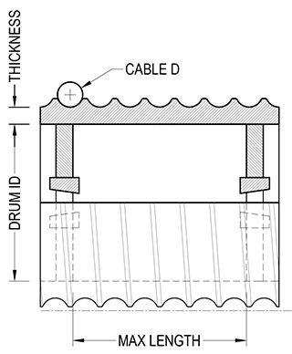

[gimmick: math]()

Max Unbraced Drum Length
===

Notes & Use
---

Calculates the maximum distance between internal braces in a helical cable drum.

* The drum must be of constant pitch diameter

Figure
---

Terms
---

&nu; = Poisson's ratio for drum material

|Material|Poisson's ratio|
|--------|---------------| 
|Steel, mild|0.303|
|Steel, high carbon|0.295|
|Steel, Cold-rolled|0.287|
|Aluminum|0.334|
|Aluminum, 6061-T6|0.35|

E = Modulus of elasticity for drum material, *psi*

|Material|E|
|--------|---------------| 
|Steel|29,000,000 *psi*|
|Aluminum|10,000,000 *psi*|

t = Drum wall thickness, after machining, *inches*

D = Internal diameter of drum, *inches*

&gamma; = Design factor, typically 8

T = tension in line, *pounds force*

d = Cable diameter, *inches*

L = Max unbrace length, *inches*

Equations
---

$$  \left[
        \left( \frac {1}{( 1 - \nu^2)} \right) ^3
        \frac {t^2}{D^2}
    \right] ^ \frac {1}{4}
    \left(
        \frac{0.807 E t^2}{\gamma T D}
    \right)
    \frac{d (2D + 2t)}{2}
$$

Sources
---

[Mechanical Design for the Stage](http://www.amazon.com/Mechanical-Design-Stage-Alan-Hendrickson/dp/024080631X/ref=sr_1_1?ie=UTF8&qid=1388378342&sr=8-1&keywords=mechanical+design+for+the+stage)
