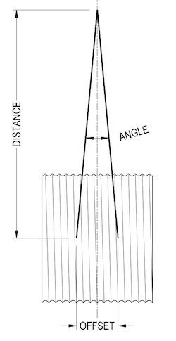

[gimmick: math]()

Fleet Angle
===

Notes & Use
---

Calculates the allowable offset distance and distance from a pulley or drum with respect to an included angle.

This calculator will calculate for all three variables by way of a user-selected drop down menu.

Figure
---

Terms
---

d = Offset distance, units of *length*

D = Distance from pulley or drum, units of *length*

&phi; = included angle, *degrees*

Equations
---

$$ \phi = atan \, \left( \frac {d}{D} \right) $$

$$ d = D \, tan \, \phi $$

$$ D = \frac {d}{tan \, \phi} $$