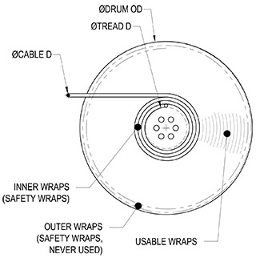

[gimmick: math]()

Payout of YoYo Drums
===

Notes & Use
---

Calculates the payout (in feet), and total number of wraps for a yoyo drum, with the following considerations...

* the yoyo drum must have a single line per groove,
* the calculation is a simplified method that divides the area of the usuable wraps by the cable diameter.  This method is not exact, but is more than adequate for the purposes of stage machines; it estimates the area of the cable pack, and divides that quantity by the cable diameter.  This method does not take into account any cable elongation.

Figure
---

Terms
---

Did = Smallest diameter of drum wrap (tread diameter), typically when the yoyo drum is empty. Does not include safety wraps, *inches*

Dod = Outer diameter of drum, typically the diameter when the yoyo drum is full, *inches*

dcable = Cable diameter, *inches*

winner = number of safety wraps on the Tread Diameter

wouter = number of safety wraps on the Outer Diameter.  This ensures the cable will not over-fill the drum and spill over the cheekplates

L = payout, the length of usable cable that will fit on the yoyo drum, *feet*

wusable = number of usable wraps, does not include safety wraps

Equations
---

Calculate the smallest diameter of the yoyo drum when the safety wraps are included...

$$ D&#x005F;{Isafe} =
    D&#x005F;{id} + 2 w&#x005F;{inner} d&#x005F;{cable}
$$

Calculate the largest diameter of the yoyo drum when the safety wraps are included...

$$ D&#x005F;{Osafe} = 
    D&#x005F;{od} - 2 w&#x005F;{outer} d&#x005F;{cable}
$$

Return the payout...
$$ L = \frac
        {   \pi \left( \frac{ D&#x005F;{Osafe}} {2} \right)^2 -
            \pi \left( \frac{ D&#x005F;{Isafe}} {2} \right)^2
        }
        {12 d&#x005F;{cable}}
$$

Return the number of wraps:
$$ w&#x005F;{usable} = \frac 
        {D&#x005F;{Osafe} - D&#x005F;{Isafe}}
        {2 d&#x005F;{cable}}
$$

Sources
---