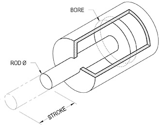

[gimmick: math]()

Piston Force & Speed
===

Notes & Use
---

The first section calculates the push force and pull force of a pneumatic/hydraulic piston, with the folowing considerations...

* The cylinder bore and rod have circular cross-sections,
* The rod &Oslash; must not exceed the bore &Oslash;
* The pressure on the opposing face of the piston cup (not the pressuring side) is assumed to be at standard atmospheric pressure

The second part of this calculator calculates values related to the piston speed and displacement, where:

* SCFM (*Standard Cubic Feet per Minute*) units are assumed to apply to pneumatic systems,
* GPM (*Gallons per Minute*) units are assumed to apply to hydraulic systems,
* Time calculations are assumed to have instantaneous acceleration and decelleration,
* CVreq calculations are assumed to be of a non-critical pressure drop.

Figure
---

Terms
---

P = pressure applied to cylinder, *pounds per square inch*

Dbore = Bore diameter, *inches*

drod = Rod diameter, *inches*

Lstroke = linear movement of piston, *inches*

Fpush = force exerted by piston rod during extension, *lbs force*

FPull = force exterted by piston rod during retraction, *lbs force*

fgpm = flow supplied to the cylinder, *Gallons per Minute*

fscfm = flow supplied to the cylinder, *Standard Cubic Feet per Minute*

pdrop = the expected loss of PSI throughout the system, *psi*

T = Temperature of gas, *&deg;F*

patm = Atmospheric pressure, *psi*

Equations
---

Calculate the areas of the bore and rod, for use in later calculations...
$$ A = \pi \left( \frac{D&#x005F;{bore}}{2} \right) ^2 $$
$$ a = \pi \left( \frac{d&#x005F;{rod}}{2} \right) ^2 $$

Calculate the forces exerted by the cylinder...
$$ F&#x005F;{push} = PA  $$
$$ F&#x005F;{pull} = P(A - a)  $$

Calculate the required flow coeficient only if the flow unit is set to *SCFM*...
$$ CV&#x005F;{required} = 
    \frac
        {60 f&#x005F;{scfm}}
        {1360}
    \sqrt 
        { \frac
            { G&#x005F;{air} (T + 460)}
            { p&#x005F;{drop} (P + p&#x005F;{atm} - p&#x005F;{drop})}
        }
$$

* Where:
* *Gair* = Specific gravity of fluid (Air = 1)

Calculate the displacement (*inches3*)...
$$ V&#x005F;{push} = L&#x005F;{stroke} A $$
$$ V&#x005F;{pull} = L&#x005F;{stroke} (A-a) $$

Calculate the piston speed (*inches per second*)...

* where flow units = *SCFM*
$$ v&#x005F;{push} = 
    \frac {f&#x005F;{scfm}} {A} \times
    \frac {1728}{60} 
$$
$$ v&#x005F;{pull} =
    \frac {f&#x005F;{scfm}} {(A-a)} \times
    \frac {1728}{60} 
$$

* where flow units = *GPM*
$$ v&#x005F;{push} =
    \frac {f&#x005F;{gpm}} {A} \times
    \frac {231}{60}
$$
$$ v&#x005F;{pull} =
    \frac {f&#x005F;{gpm}} {(A-a)}
    \frac {231}{60}
$$

Calculate the time for piston extension (*seconds*)...
$$ t&#x005F;{push} = \frac {L&#x005F;{stroke}}{v&#x005F;{push}} $$

Calculate the time for piston retraction (*seconds*)...
$$ t&#x005F;{pull} = \frac {L&#x005F;{stroke}}{v&#x005F;{pull}} $$

Sources
---

[Engineering Toolbox](http://www.engineeringtoolbox.com/flow-coefficients-d_277.html)
